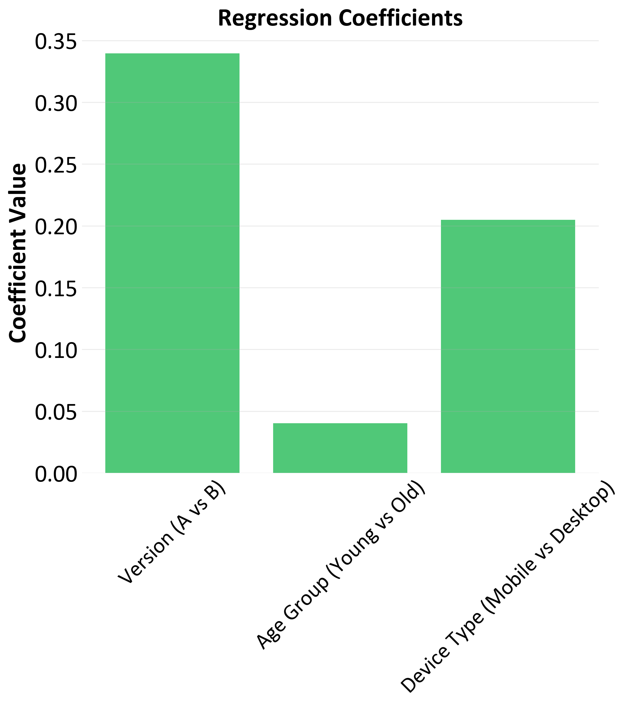

# A-B-test-simulation

Python script simulates an A/B test comparing two versions of an app feature, measuring conversion rates and testing for statistical significance and Bayesian analysis. 

Includes a power analysis to calculate the required sample size for robust results, a t-test to determine if differences are significant, Bayesian inference using the Beta-Binomial model to calculate probabilities, and multivariate logistic regression to examine factors related to conversion rate.

  
  
  

