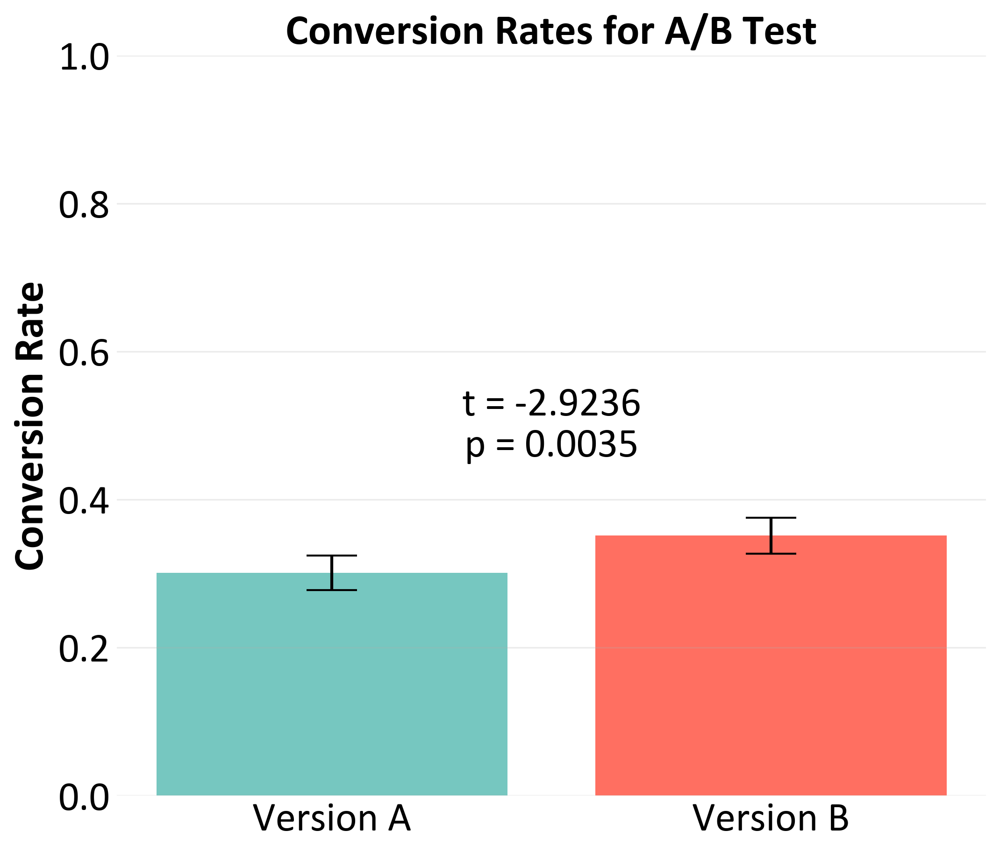

# A-B-test-simulation

Python script simulates an A/B test comparing two versions of an app feature, measuring conversion rates and testing for statistical significance. Includes a power analysis to calculate the required sample size for robust results, and a t-test to determine if differences are significant.

  
  

